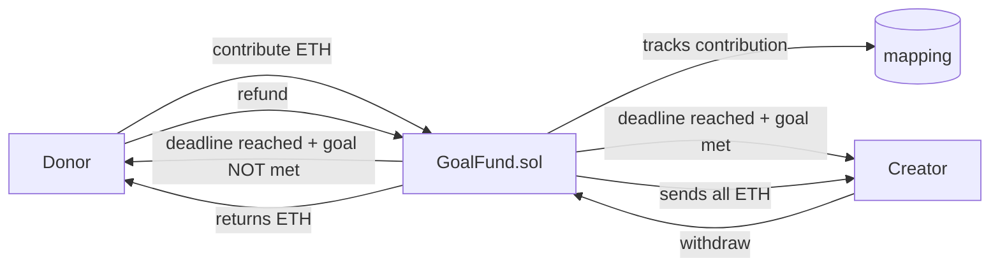

# GoalFund — Trustless crowdfunding with automatic refunds if the goal is not met

> Contributors send ETH to a campaign. If the goal is reached by the deadline,
> the creator withdraws. If not, every donor gets a full refund — guaranteed by code.


🔗 **Live demo:** _coming soon_
📜 **Contract (Sepolia):** _deploy pending_

---

## What it does

- Anyone can **contribute ETH** while the campaign is active.
- If the **goal is reached** by the deadline, the creator can withdraw all funds.
- If the **goal is not reached**, every donor can claim a full refund — no trust needed.
- All logic is enforced on-chain: no admin can change the rules mid-campaign.

## How it works



## Tech stack

| Layer | Tech |
|-------|------|
| Smart contract | Solidity 0.8.24 |
| Dev / testing | Foundry (forge, anvil) |
| Frontend | Next.js + wagmi + viem + RainbowKit |
| Network | Ethereum Sepolia testnet |

## Key design decisions

**Why `immutable` for goal and deadline?**
They are set once in the constructor and never change. `immutable` saves gas
(no SLOAD — the value is baked into the bytecode) and signals intent clearly.

**Why CEI pattern in `refund`?**
The refund sends ETH with `.call`, which can trigger code in the receiver's contract.
Setting `contributions[msg.sender] = 0` before the transfer prevents a malicious
donor from re-entering `refund` and draining the contract.

**Why `withdrawn` flag instead of zeroing `totalRaised`?**
`totalRaised` is useful for display after withdrawal. A dedicated boolean is
explicit and avoids confusion about what the balance means.

## Testing ⭐

```bash
forge test -vvv
```

18 tests covering:
- ✅ Contribution updates balances and emits event
- ✅ Reverts: after deadline, zero value
- ✅ Creator withdraws when goal is reached after deadline
- ✅ Reverts: not creator, goal not reached, campaign active, already withdrawn
- ✅ Donor gets full refund when goal not reached
- ✅ Reverts: goal was reached, nothing to refund, campaign active, double refund
- ✅ `isActive` and `isGoalReached` view functions

## Run locally

```bash
forge build
forge test -vvv

# deploy to Sepolia
cp .env.example .env
source .env && forge script script/Deploy.s.sol \
  --rpc-url $SEPOLIA_RPC_URL --private-key $PRIVATE_KEY --broadcast
```

## What I learned

This contract handles ETH from multiple users simultaneously — the first time
state management gets critical. The CEI pattern in `refund` directly prevents
a reentrancy attack: if I sent ETH before zeroing the balance, a malicious
contract could call `refund` again before the state updated and drain the funds.

---

## Contact

**Armando Ochoa** · Smart Contract Developer
📧 armaochoa99@gmail.com · Open to Web3 opportunities.

> Built as part of my blockchain developer journey.
